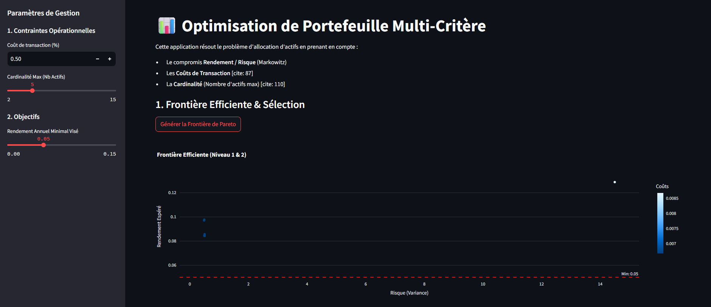
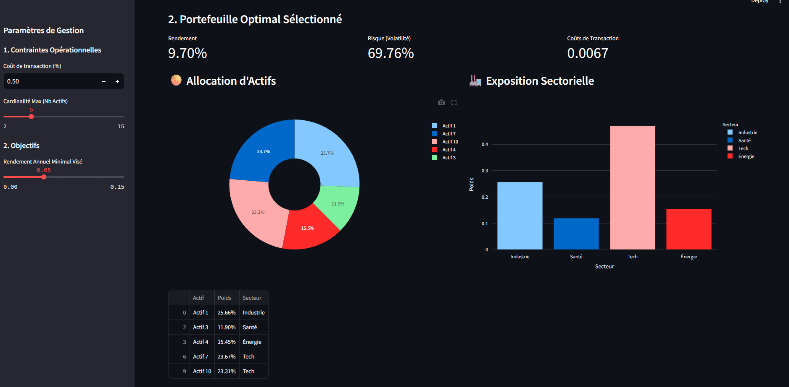

# Optimisation de Portefeuille Multi-Critère

Ce projet est la réalisation finale d'un TP sur la modélisation et la résolution d'un problème d'**optimisation de portefeuille d'actifs** . Il utilise la théorie moderne du portefeuille (Markowitz) et y ajoute des contraintes réelles du monde financier comme la **cardinalité** et les **coûts de transaction**.

Le moteur d'optimisation est développé en **Python** et l'application est présentée via une interface interactive **Streamlit**.

## Fonctionnalités Clés

Le projet résout un problème d'optimisation bi-objectif (Rendement vs. Risque) puis tri-objectif (Rendement vs. Risque vs. Coûts de Transaction), avec des contraintes opérationnelles :

| Niveau | Objectifs | Contraintes | Outil Mathématique |
| :--- | :--- | :--- | :--- |
| **Niveau 1** | Rendement $(f_1)$, Risque $(f_2)$ | Budget $(\sum w_i = 1, w_i \ge 0)$ | Optimisation Quadratique |
| **Niveau 2** | Rendement $(f_1)$, Risque $(f_2)$, **Coûts** $(f_3)$ | Cardinalité $(\text{Card}(w) = K)$, Rendement Min. | Optimisation Non-Convexe (Heuristique/Scalarisation) |
| **Démonstrateur**| Visualisation et Sélection | $r_{min}$ (défini par l'utilisateur) | Streamlit |

## Formalisation Mathématique

Le problème général consiste à minimiser une combinaison pondérée des objectifs sous contraintes :

$$
[
\min_{w}\bigl(\lambda, f_2(w);-;(1-\lambda), f_1(w);+;f_3(w)\bigr)
]
$$

Sujet à :

1.  **Contrainte de Budget ($C_{Base}$) :** $\sum w_i = 1$ et $w_i \ge 0$.
2.  **Contrainte de Cardinalité ($C_{Op}$) :** $\sum_{i=1}^{N} \mathbb{I}(w_{i} > \delta_{tol}) = K$.
3.  **Rendement Minimal :** $-f_1(w) = w^T\mu \ge r_{min}$ (pour la sélection finale).

Où :

  * $w$ est le vecteur des poids d'actifs.
  * $f_1(w) = -w^T\mu$ (Négatif du rendement espéré, à minimiser).
  * $f_2(w) = w^T \Sigma w$ (Variance, à minimiser).
  * $f_3(w) = \sum c_{prop} |w_i - w_{t,i}|$ (Coûts de transaction, à minimiser).

-----

## ⚙️ Installation et Lancement

Ce projet nécessite Python 3.9+.

### 1\. Prérequis

Créez et activez un environnement virtuel (recommandé) :

```bash
# Créer l'environnement
python -m venv venv 

# Activer l'environnement (Windows)
.\venv\Scripts\activate
# Activer l'environnement (Linux/macOS)
source venv/bin/activate
```

### 2\. Installation des Dépendances

Installez les bibliothèques requises (Streamlit, NumPy, SciPy, Plotly) :

```bash
pip install -r requirements.txt
```

### 3\. Structure des Fichiers

Assurez-vous d'avoir la structure de répertoire suivante :

```
portfolio_project/
├── optimizer.py          # Le cœur de la logique d'optimisation (backend)
├── app.py                # L'interface utilisateur Streamlit (frontend)
└── requirements.txt
```

### 4\. Lancement de l'Application

Lancez l'application Streamlit depuis le répertoire racine du projet :

```bash
streamlit run app.py
```

L'application s'ouvrira automatiquement dans votre navigateur à l'adresse `http://localhost:8501`.

-----

## ✨ Aperçu de l'Application Streamlit

### 1. Frontière Efficiente (Risque / Rendement)


### 2. Allocation du Portefeuille Sélectionné


----

## 💻 Développement

### `optimizer.py`

Ce module encapsule la classe `PortfolioOptimizer`. Il gère :

  * La simulation ou l'ingestion des données (rendements $\mu$ et covariance $\Sigma$).
  * Le calcul des fonctions objectifs $f_1$, $f_2$ et $f_3$.
  * La fonction d'optimisation principale `optimize()` utilisant **SciPy.optimize (SLSQP)**.
  * L'intégration de la contrainte de cardinalité $K$ via une méthode heuristique (pré-sélection des K meilleurs actifs) pour contourner la non-convexité du problème.

### `app.py`

Ce module est l'interface utilisateur. Il permet :

  * De paramétrer les contraintes de coût et de cardinalité via la barre latérale.
  * De définir le seuil de rendement minimal souhaité ($r_{min}$).
  * De générer et d'afficher la **Frontière de Pareto** (Risque vs. Rendement) en utilisant la couleur pour visualiser la troisième dimension (Coûts de transaction).
  * De sélectionner et d'afficher la composition du portefeuille optimal répondant aux critères de l'utilisateur (Rendement $\ge r_{min}$ et Risque minimal).
  * De fournir une analyse sectorielle via des graphiques en secteurs et en barres.
